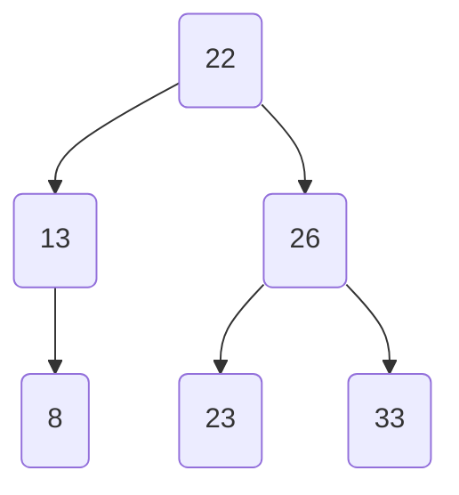

![[Pasted image 20250722172507.png]]
Um einen AVL-Baum zu konstruieren, indem die Elemente 24, 23, 6, 10, 8, 11 in dieser Reihenfolge in einen anfangs leeren Baum eingefügt werden, und um Balanceverletzungen zu identifizieren sowie die erforderlichen Ausgleichsoperationen durchzuführen, gehen wir Schritt für Schritt vor:

1. **Einfügen von 24**:  
   - Der Baum wird zu einem einzelnen Knoten:  
     ```
     24
     ```
   - Keine Balanceverletzung (Höhenunterschied ≤ 1).

2. **Einfügen von 23**:  
   - Füge 23 als linkes Kind von 24 hinzu:  
     ```
       24
      /
     23
     ```
   - Höhen: Linker Unterbaum (1), Rechter Unterbaum (0). Balancefaktor von 24 = 1 - 0 = 1. Keine Verletzung.

3. **Einfügen von 6**:  
   - Füge 6 als linkes Kind von 23 hinzu:  
     ```
       24
      /
     23
    /
   6
   ```
   - Höhen: Linker Unterbaum (2), Rechter Unterbaum (0). Balancefaktor von 24 = 2 - 0 = 2. Dies ist eine Balanceverletzung (überschreitet 1).  
   - **Ausgleich**: Führe eine Rechtsrotation an 23 durch:  
     - Neuer Baum:  
       ```
         23
        /  \
       6    24
       ```
     - Balancefaktoren: Alle Knoten haben einen Balancefaktor von 0. Der Baum ist ausgeglichen.

4. **Einfügen von 10**:  
   - Füge 10 als rechtes Kind von 6 hinzu:  
     ```
         23
        /  \
       6    24
      /
     10
     ```
   - Höhen: Linker Unterbaum von 23 (2), Rechter Unterbaum (1). Balancefaktor von 23 = 2 - 1 = 1. Keine Verletzung.

5. **Einfügen von 8**:  
   - Füge 8 als linkes Kind von 10 hinzu:  
     ```
         23
        /  \
       6    24
      /
     10
    /
   8
   ```
   - Höhen: Linker Unterbaum von 10 (1), Rechter Unterbaum (0). Balancefaktor von 10 = 1 - 0 = 1.  
   - Höhen: Linker Unterbaum von 23 (3), Rechter Unterbaum (1). Balancefaktor von 23 = 3 - 1 = 2. Dies ist eine Balanceverletzung.  
   - **Ausgleich**: Die Verletzung befindet sich bei 23 aufgrund des linken-links-Falls (der neue Knoten 8 befindet sich im linken Unterbaum des linken Kindes von 23). Führe eine Rechtsrotation an 23 durch:  
     - Neuer Baum:  
       ```
         10
        /  \
       6    23
      /    /
     8    24
     ```
     - Balancefaktoren: Alle Knoten haben einen Balancefaktor von 0 oder 1. Der Baum ist ausgeglichen.

6. **Einfügen von 11**:  
   - Füge 11 als rechtes Kind von 10 hinzu:  
     ```
         10
        /  \
       6    23
      /    /
     8    24
          /
         11
     ```
   - Höhen: Linker Unterbaum von 10 (2), Rechter Unterbaum (2). Balancefaktor von 10 = 2 - 2 = 0. Keine Verletzung.

**Finaler AVL-Baum**:  
```
     10
    /  \
   6    23
  /    /  \
 8    24  11
```

**Balanceverletzungen und Operationen**:  
- Nach dem Einfügen von 6 trat eine Balanceverletzung bei 24 auf (Balancefaktor 2), die durch eine Rechtsrotation an 23 behoben wurde.  
- Nach dem Einfügen von 8 trat eine Balanceverletzung bei 23 auf (Balancefaktor 2), die durch eine Rechtsrotation an 23 behoben wurde.  

Der finale Baum ist ein ausbalancierter AVL-Baum.

![[Pasted image 20250722182709.png]]

Absolut\! Hier ist die schrittweise Lösung für das Löschen der Elemente 29, 7 und 9 aus dem gegebenen AVL-Baum.

### Ausgangssituation

Der anfängliche AVL-Baum sieht wie folgt aus:

-----

### 1\. Löschen von 29

Das Löschen des Blattelements **29** führt zu einer Verletzung der Balance-Bedingung beim Knoten **26**.

  * **Baum nach dem Löschen von 29 (Balance verletzt)**

    Der linke Teilbaum von Knoten 26 hat nun die Höhe 2, während der rechte Teilbaum (nach dem Löschen von 29) nur noch die Höhe 0 hat. Dies ergibt einen Balance-Faktor von $2 - 0 = 2$.

    ```mermaid
    graph TD
        A(26) --> B(13)
        A --> C(33)
        B --> D(8)
        B --> E(22)
        D --> F(7)
        D --> G(9)
        E --> H(23)
        style A fill:#f77,stroke:#333,stroke-width:2px
    ```

  * **Balance-Operation: Rechts-Rotation**

    Da der Knoten 26 (Balance-Faktor +2) und sein linkes Kind 13 (Balance-Faktor 0) die Verletzung verursachen, wird eine einfache **Rechts-Rotation** um den Knoten 26 durchgeführt.

  * **Baum nach der Rotation**

    Der Knoten 13 wird zur neuen Wurzel, und der Knoten 26 wird sein rechter Nachfolger. Der ursprüngliche rechte Nachfolger von 13 (der Knoten 22) wird zum neuen linken Nachfolger von 26.

    ```mermaid
    graph TD
        B(13) --> D(8)
        B --> A(26)
        D --> F(7)
        D --> G(9)
        A --> E(22)
        A --> C(33)
        E --> H(23)
    ```

-----

### 2\. Löschen von 7

Als Nächstes wird das Element **7** aus dem resultierenden Baum entfernt. Das Löschen dieses Blattelements **verletzt die Balance-Bedingung nicht**. Die Balance-Faktoren aller Knoten bleiben im gültigen Bereich (also -1, 0 oder 1).

  * **Baum nach dem Löschen von 7**

    ```mermaid
    graph TD
        B(13) --> D(8)
        B --> A(26)
        D --> G(9)
        A --> E(22)
        A --> C(33)
        E --> H(23)
    ```

-----

### 3\. Löschen von 9

Zuletzt wird das Element **9** entfernt. Dies führt erneut zu einer Verletzung der Balance-Bedingung, diesmal beim Knoten **13**.

  * **Baum nach dem Löschen von 9 (Balance verletzt)**

    Der linke Teilbaum von Knoten 13 hat nun die Höhe 0, während der rechte Teilbaum (mit Wurzel 26) die Höhe 2 hat. Dies ergibt einen Balance-Faktor von $0 - 2 = -2$.

    ```mermaid
    graph TD
        B(13) --> D(8)
        B --> A(26)
        A --> E(22)
        A --> C(33)
        E --> H(23)
        style B fill:#f77,stroke:#333,stroke-width:2px
    ```

  * **Balance-Operation: Links-Rechts-Rotation**

    Die Verletzung bei Knoten 13 (Balance-Faktor -2) und seinem rechten Kind 26 (Balance-Faktor +1) erfordert eine Doppelrotation: eine **Links-Rechts-Rotation** um den Knoten 13.

    1.  Zuerst eine Rechts-Rotation um den Knoten 26.
    2.  Anschließend eine Links-Rotation um den Knoten 13.

  * **Finaler Baum nach der Rotation**

    Der Knoten 22 wird zur neuen Wurzel des Baumes.




