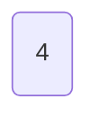
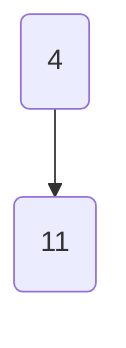
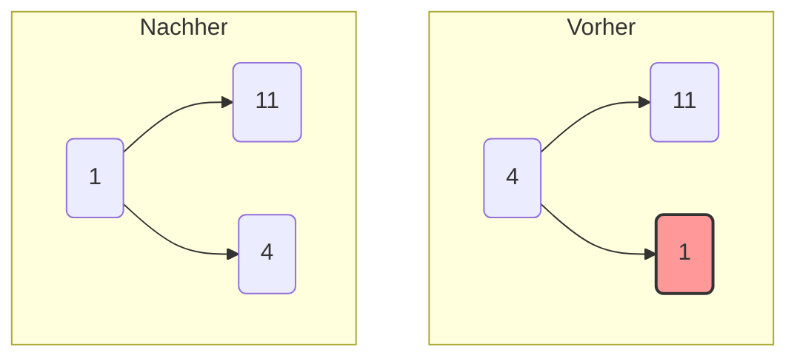
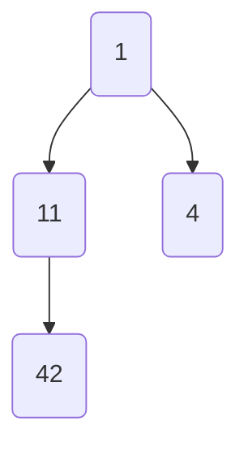
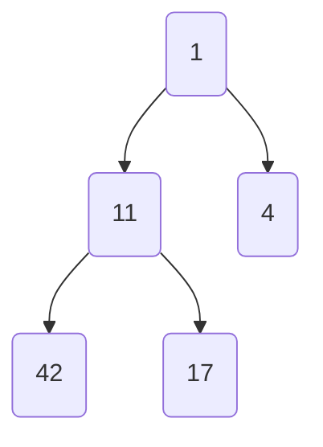
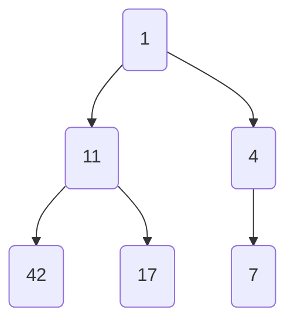
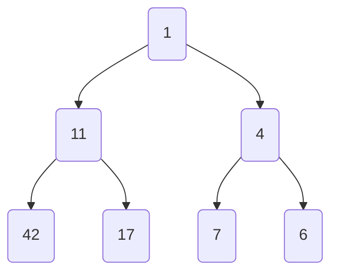
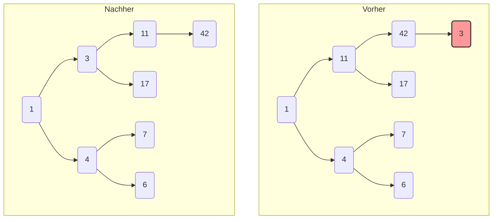
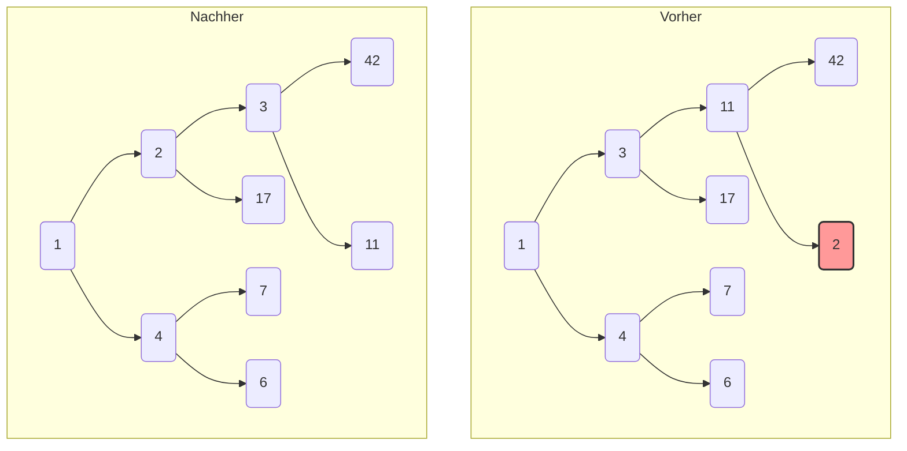
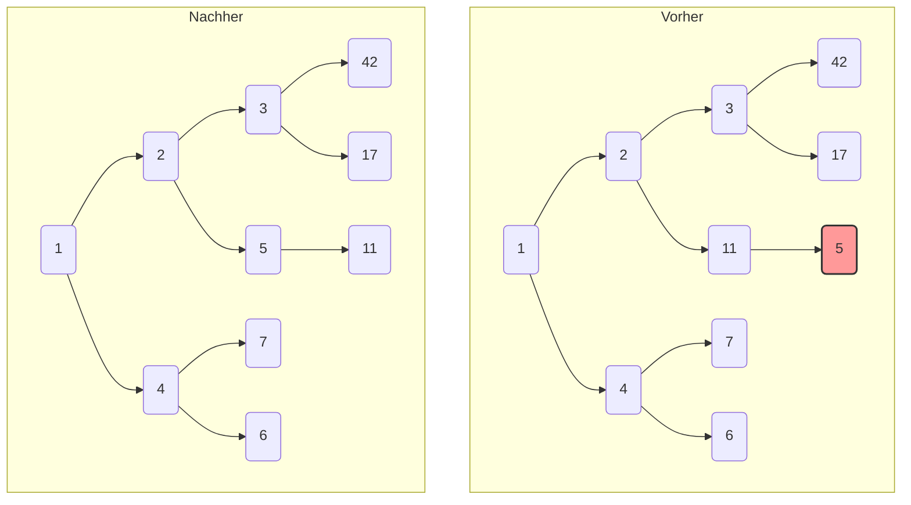

Fügen Sie die Zahlen 4, 11, 1, 42, 17, 7, 6, 3, 2, 5 in der angegebenen Reihenfolge in einen anfangs leeren Minimum-Heap. Zeichnen Sie den Baum nach jeder Einfügenoperation

Bei jeder Einfügung wird die neue Zahl an die nächste freie Position im Baum gesetzt und dann bei Bedarf nach oben verschoben („heapify-up“), um die Heap-Bedingung (Elternknoten ist kleiner als seine Kinder) wiederherzustellen.

-----

### **1. Füge 4 hinzu**

Der Baum ist leer, also wird 4 zur Wurzel.

### **2. Füge 11 hinzu**

11 wird als linkes Kind von 4 eingefügt. Da `11 > 4` ist, bleibt die Heap-Bedingung erfüllt.

### **3. Füge 1 hinzu**

1 wird als rechtes Kind von 4 eingefügt. Da `1 < 4` ist, wird die Heap-Bedingung verletzt. Die beiden werden vertauscht.

### **4. Füge 42 hinzu**

42 wird als linkes Kind von 11 eingefügt. Da `42 > 11` ist, ist alles in Ordnung.

### **5. Füge 17 hinzu**

17 wird als rechtes Kind von 11 eingefügt. Da `17 > 11` ist, ist die Heap-Bedingung erfüllt.

### **6. Füge 7 hinzu**

7 wird als linkes Kind von 4 eingefügt. Da `7 > 4` ist, ist alles in Ordnung.

### **7. Füge 6 hinzu**

6 wird als rechtes Kind von 4 eingefügt. Da `6 > 4` ist, bleibt die Heap-Bedingung erfüllt.

### **8. Füge 3 hinzu**

3 wird als linkes Kind von 42 eingefügt.

1.  `3 < 42` → Tausch.
2.  `3 < 11` → Tausch.
3.  `3 > 1` → Stopp.

<!-- end list -->

### **9. Füge 2 hinzu**

2 wird als rechtes Kind von 11 eingefügt.

1.  `2 < 11` → Tausch.
2.  `2 < 3` → Tausch.
3.  `2 > 1` → Stopp.

<!-- end list -->

### **10. Füge 5 hinzu (Finaler Baum)**

5 wird als linkes Kind von 7 eingefügt.

1.  `5 < 7` → Tausch.
2.  `5 > 4` → Stopp.

<!-- end list -->

---

![[Pasted image 20250723171418.png]]

Der ursprüngliche Heap ist wie folgt aufgebaut:

## Heap im Array-Format

Um die Schritte besser nachvollziehen zu können, stellen wir den Heap zunächst im Array-Format dar. Ein Minimum-Heap erfüllt die Eigenschaft, dass der Wert jedes Knotens kleiner oder gleich den Werten seiner Kinder ist.

Der gegebene Heap im Array-Format (Index 0 wird oft leer gelassen oder für den Wurzelknoten verwendet, hier verwenden wir 1-basiert, um der Baumstruktur zu folgen, oder 0-basiert, wenn dies impliziert ist. Für die Darstellungszwecke nehmen wir an, dass die Array-Indizes von oben nach unten und von links nach rechts gefüllt werden, beginnend bei 0):

Array: [3,4,7,9,5,22,11,43,14,12]

---

## 1. Löschvorgang (Minimum: 3)

1. **Entfernen des Minimums (Wurzel):** Das minimale Element ist **3**. Wir entfernen es.
    
2. Ersetzen durch das letzte Element: Das letzte Element im Heap (im Array) ist 12. Wir ersetzen die Wurzel durch 12.
    
    Array: [12,4,7,9,5,22,11,43,14]
    
3. Heapify-Down: Nun müssen wir das Element 12 nach unten "sacken" lassen (heapify-down), bis der Heap-Eigenschaft wiederhergestellt ist. Wir vergleichen 12 mit seinen Kindern (4 und 7). Das kleinere Kind ist 4. Wir tauschen 12 mit 4.
    
    Array: [4,12,7,9,5,22,11,43,14]
    
    Jetzt vergleichen wir 12 mit seinen neuen Kindern (9 und 5). Das kleinere Kind ist 5. Wir tauschen 12 mit 5.
    
    Array: [4,5,7,9,12,22,11,43,14]
    
    Jetzt vergleichen wir 12 mit seinem Kind (14). 12 ist kleiner als 14, also stoppt der Vorgang.
    

**Heap nach dem 1. Löschvorgang:**

Array: [4,5,7,9,12,22,11,43,14]

---

## 2. Löschvorgang (Minimum: 4)

1. **Entfernen des Minimums (Wurzel):** Das minimale Element ist **4**. Wir entfernen es.
    
2. Ersetzen durch das letzte Element: Das letzte Element im Heap ist 14. Wir ersetzen die Wurzel durch 14.
    
    Array: [14,5,7,9,12,22,11,43]
    
3. Heapify-Down: Vergleiche 14 mit seinen Kindern (5 und 7). Das kleinere Kind ist 5. Tausche 14 mit 5.
    
    Array: [5,14,7,9,12,22,11,43]
    
    Vergleiche 14 mit seinen neuen Kindern (9 und 12). Das kleinere Kind ist 9. Tausche 14 mit 9.
    
    Array: [5,9,7,14,12,22,11,43]
    Fügen Sie die Zahlen 4, 11, 1, 42, 17, 7, 6, 3, 2, 5 in der angegebenen Reihenfolge in einen anfangs leeren Minimum-Heap. Zeichnen s

ie den Baum nach jeder Einfügenoperation
    Vergleiche 14 mit seinen neuen Kindern (43). 14 ist kleiner als 43, also stoppt der Vorgang.
    

**Heap nach dem 2. Löschvorgang:**

Array: [5,9,7,14,12,22,11,43]

---

## 3. Löschvorgang (Minimum: 5)

1. **Entfernen des Minimums (Wurzel):** Das minimale Element ist **5**. Wir entfernen es.
    
2. Ersetzen durch das letzte Element: Das letzte Element im Heap ist 43. Wir ersetzen die Wurzel durch 43.
    
    Array: [43,9,7,14,12,22,11]
    
3. Heapify-Down: Vergleiche 43 mit seinen Kindern (9 und 7). Das kleinere Kind ist 7. Tausche 43 mit 7.
    
    Array: [7,9,43,14,12,22,11]
    
    Vergleiche 43 mit seinen neuen Kindern (22 und 11). Das kleinere Kind ist 11. Tausche 43 mit 11.
    
    Array: [7,9,11,14,12,22,43]
    
    43 hat keine Kinder mehr.
    

**Heap nach dem 3. Löschvorgang:**

Array: [7,9,11,14,12,22,43]

---

## 4. Löschvorgang (Minimum: 7)

1. **Entfernen des Minimums (Wurzel):** Das minimale Element ist **7**. Wir entfernen es.
    
2. Ersetzen durch das letzte Element: Das letzte Element im Heap ist 43. Wir ersetzen die Wurzel durch 43.
    
    Array: [43,9,11,14,12,22]
    
3. Heapify-Down: Vergleiche 43 mit seinen Kindern (9 und 11). Das kleinere Kind ist 9. Tausche 43 mit 9.
    
    Array: [9,43,11,14,12,22]
    
    Vergleiche 43 mit seinen neuen Kindern (14 und 12). Das kleinere Kind ist 12. Tausche 43 mit 12.
    
    Array: [9,12,11,14,43,22]
    
    Vergleiche 43 mit seinem neuen Kind (22). 22 ist kleiner als 43. Tausche 43 mit 22.
    
    Array: [9,12,11,14,22,43]
    
    43 hat keine Kinder mehr.
    

**Heap nach dem 4. Löschvorgang:**

Array: [9,12,11,14,22,43]

---

## 5. Löschvorgang (Minimum: 9)

1. **Entfernen des Minimums (Wurzel):** Das minimale Element ist **9**. Wir entfernen es.
    
2. Ersetzen durch das letzte Element: Das letzte Element im Heap ist 43. Wir ersetzen die Wurzel durch 43.
    
    Array: [43,12,11,14,22]
    
3. Heapify-Down: Vergleiche 43 mit seinen Kindern (12 und 11). Das kleinere Kind ist 11. Tausche 43 mit 11.
    
    Array: [11,12,43,14,22]
    
    Vergleiche 43 mit seinen neuen Kindern (14 und 22). Das kleinere Kind ist 14. Tausche 43 mit 14.
    
    Array: [11,12,14,43,22]
    
    Vergleiche 43 mit seinem neuen Kind (22). 22 ist kleiner als 43. Tausche 43 mit 22.
    
    Array: [11,12,14,22,43]
    
    43 hat keine Kinder mehr.
    

**Heap nach dem 5. Löschvorgang:**

Array: [11,12,14,22,43]