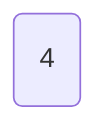
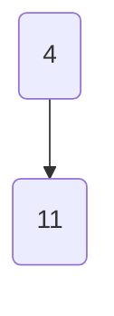
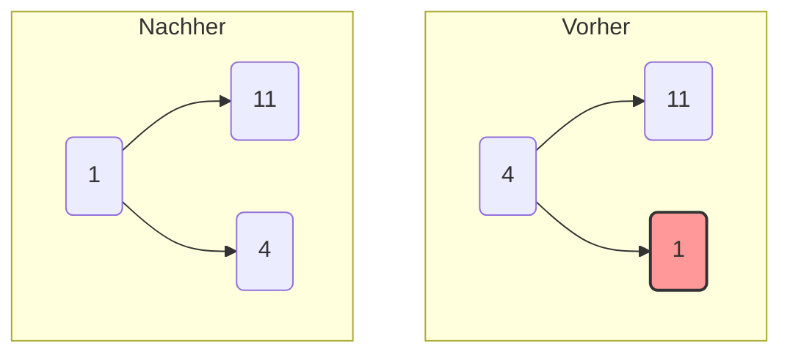
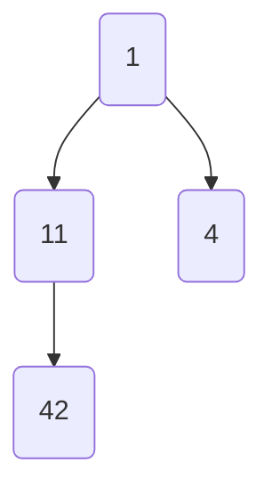
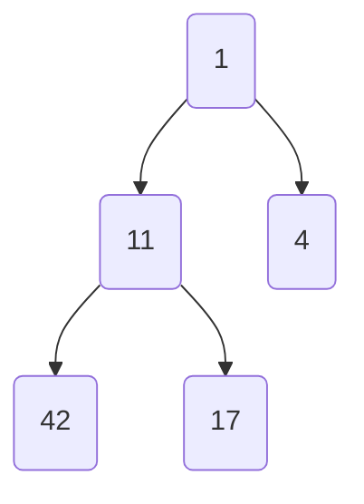
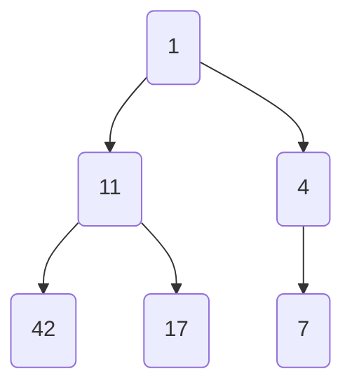
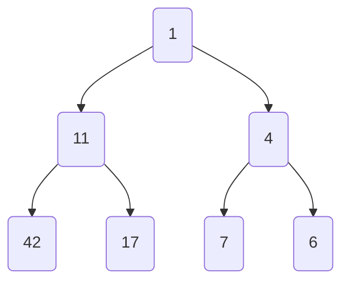
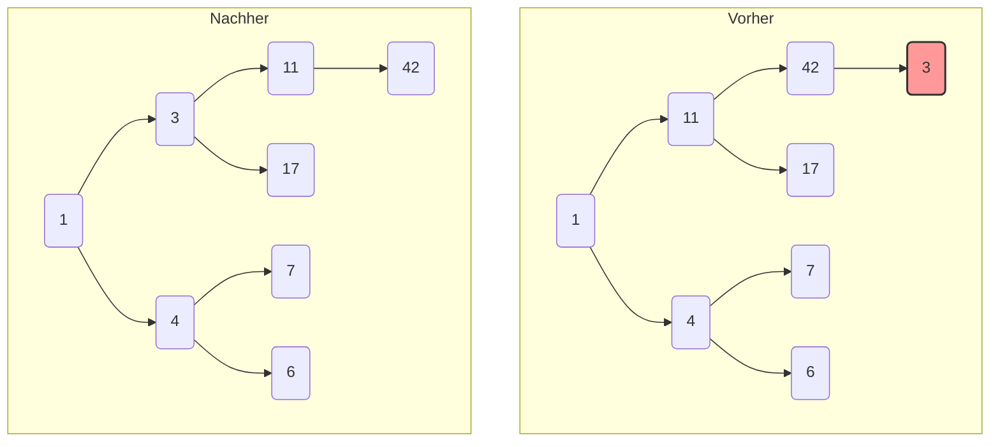
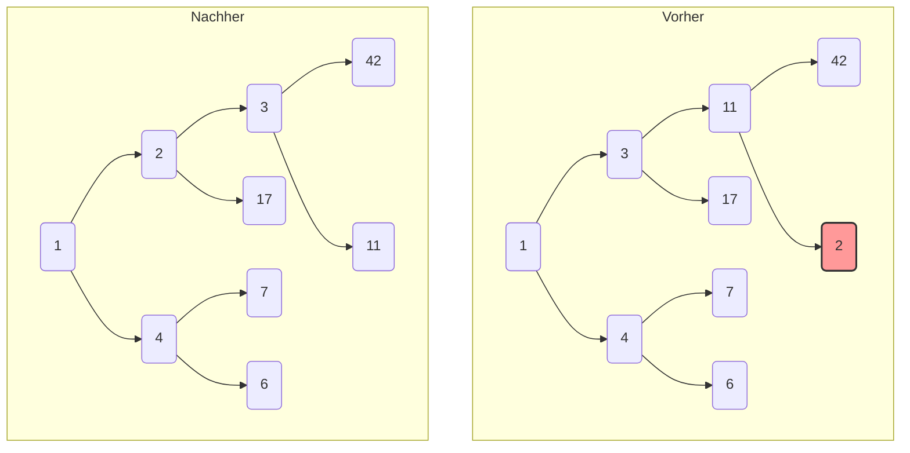
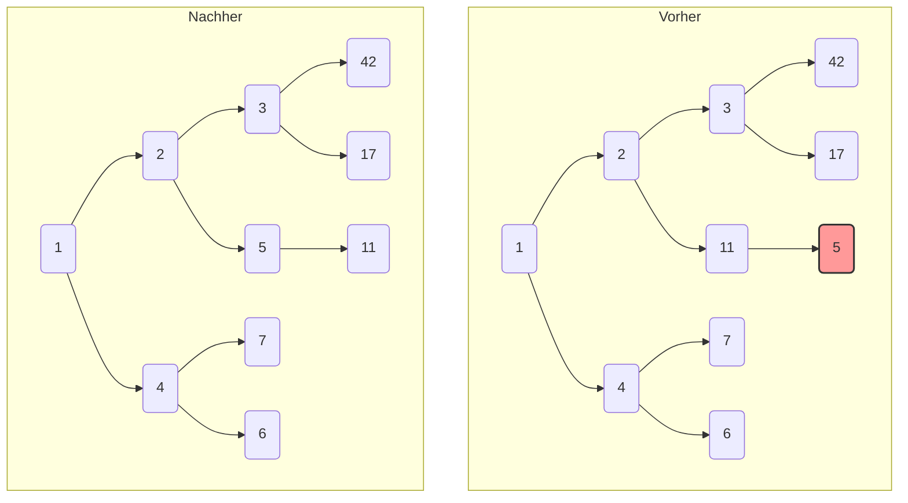

Klar, hier ist der schrittweise Aufbau des Minimum-Heaps. Bei jeder Einfügung wird die neue Zahl an die nächste freie Position im Baum gesetzt und dann bei Bedarf nach oben verschoben („heapify-up“), um die Heap-Bedingung (Elternknoten ist kleiner als seine Kinder) wiederherzustellen.

-----

### **1. Füge 4 hinzu**

Der Baum ist leer, also wird 4 zur Wurzel.

### **2. Füge 11 hinzu**

11 wird als linkes Kind von 4 eingefügt. Da `11 > 4` ist, bleibt die Heap-Bedingung erfüllt.

### **3. Füge 1 hinzu**

1 wird als rechtes Kind von 4 eingefügt. Da `1 < 4` ist, wird die Heap-Bedingung verletzt. Die beiden werden vertauscht.

### **4. Füge 42 hinzu**

42 wird als linkes Kind von 11 eingefügt. Da `42 > 11` ist, ist alles in Ordnung.

### **5. Füge 17 hinzu**

17 wird als rechtes Kind von 11 eingefügt. Da `17 > 11` ist, ist die Heap-Bedingung erfüllt.

### **6. Füge 7 hinzu**

7 wird als linkes Kind von 4 eingefügt. Da `7 > 4` ist, ist alles in Ordnung.

### **7. Füge 6 hinzu**

6 wird als rechtes Kind von 4 eingefügt. Da `6 > 4` ist, bleibt die Heap-Bedingung erfüllt.

### **8. Füge 3 hinzu**

3 wird als linkes Kind von 42 eingefügt.

1.  `3 < 42` → Tausch.
2.  `3 < 11` → Tausch.
3.  `3 > 1` → Stopp.

<!-- end list -->

### **9. Füge 2 hinzu**

2 wird als rechtes Kind von 11 eingefügt.

1.  `2 < 11` → Tausch.
2.  `2 < 3` → Tausch.
3.  `2 > 1` → Stopp.

<!-- end list -->

### **10. Füge 5 hinzu (Finaler Baum)**

5 wird als linkes Kind von 7 eingefügt.

1.  `5 < 7` → Tausch.
2.  `5 > 4` → Stopp.

<!-- end list -->

